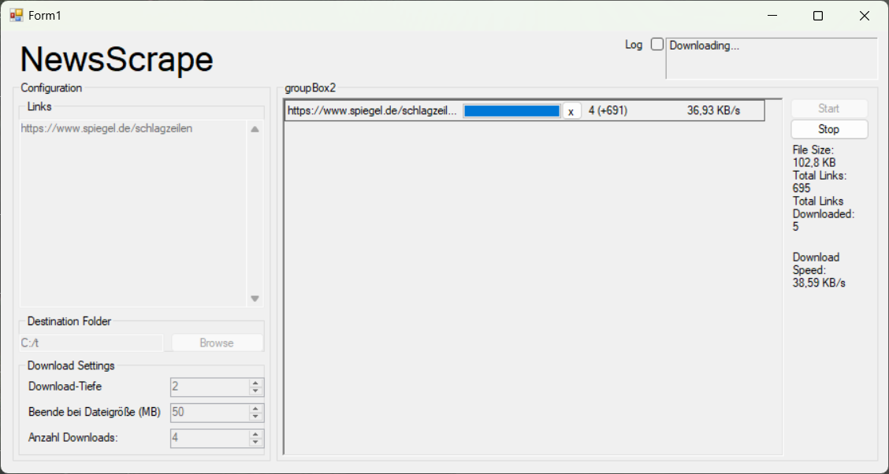

# NewsScrape


A Windows Forms application for web scraping and content extraction from news websites. This tool allows you to download and process web content from multiple domains simultaneously, with configurable depth and progress tracking.

## Features

- Multi-threaded web scraping with progress tracking
- Configurable scraping depth for each domain
- Real-time progress monitoring with visual feedback
- Ability to cancel individual domain downloads
- Automatic link discovery and recursive scraping
- UTF-8 encoding support for international content
- Clean text extraction from HTML content
- User-friendly Windows Forms interface

## Requirements

- Windows OS
- .NET Framework 4.7.2 or higher
- Visual Studio 2019 or higher (for development)

## Dependencies

- HtmlAgilityPack (v1.11.46) - For HTML parsing and content extraction
- Newtonsoft.Json (v13.0.3) - For JSON handling
- System.Configuration.ConfigurationManager (v7.0.0)
- System.Security.AccessControl (v6.0.0)
- System.Security.Permissions (v7.0.0)
- System.Security.Principal.Windows (v5.0.0)

## Installation

1. Clone the repository:
```bash
git clone https://github.com/yourusername/NewsScrape.git
```

2. Open the solution file `NewsScrape.sln` in Visual Studio

3. Restore NuGet packages:
```bash
nuget restore NewsScrape.sln
```

4. Build the solution:
```bash
msbuild NewsScrape.sln
```

## Usage



The application interface provides the following features:

- **Links**: Add URLs to scrape in the text area on the left
- **Destination Folder**: Select where to save the scraped content
- **Download Settings**:
  - Download-Tiefe (Depth): Set how many levels deep to follow links (default: 2)
  - Beende bei Dateigröße (MB): Set maximum file size limit in MB (default: 50)
  - Anzahl Downloads: Set number of concurrent downloads (default: 4)
- **Start/Stop**: Control the scraping process
- **Progress Tracking**: Monitor download progress for each URL in the main panel

1. Launch the application
2. Enter the URL(s) you want to scrape
3. Configure the maximum depth for link following
4. Click the start button to begin scraping
5. Monitor progress through the interface
6. Use the cancel button (x) to stop scraping for specific domains

## Project Structure

- `Program.cs` - Application entry point
- `Form1.cs` - Main application form and UI logic
- `Webpage.cs` - Core scraping functionality and domain management
- `Helper.cs` - Utility functions and helper methods

## Contributing

1. Fork the repository
2. Create your feature branch (`git checkout -b feature/AmazingFeature`)
3. Commit your changes (`git commit -m 'Add some AmazingFeature'`)
4. Push to the branch (`git push origin feature/AmazingFeature`)
5. Open a Pull Request

## License

This project is licensed under the MIT License - see the [LICENSE](LICENSE) file for details.
